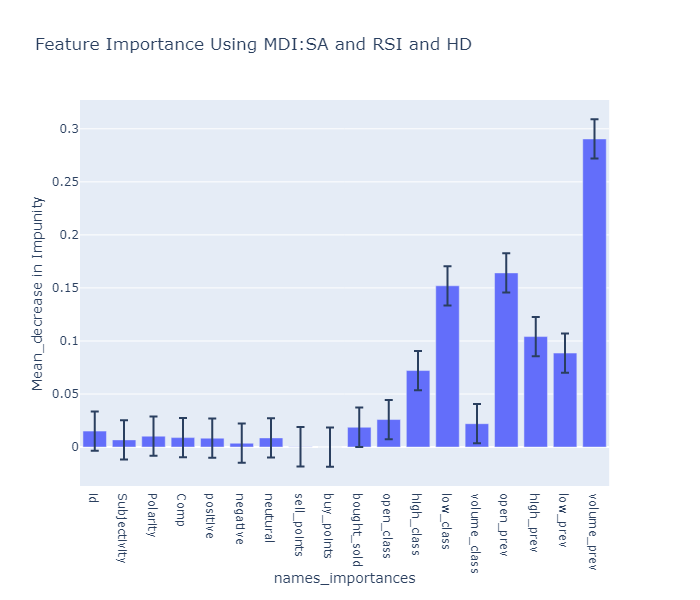

# Sentiment Analysis of Crypto Currencies: Ethereum
### Author: Eric Romano
## Overview

In the week of May 15th , the market experienced a volatile environment for cryptocurrencies with Bitcoins plugging to half of it all time high of $60,000. A total of $830 billion lost by investors causing many investors to go bankrupt.

## Business Problem 

Many retail investors would like to have tools to have at there disposal to make predictions that can lead to better returns or better exit strategies. The crypto market is strongly connected to retail investors and their emotions. Using Sentiment Analysis and other metrics such as Relative Strength Index we believe these will provide a useful in creating tools that will classify if the market closes higher or lower than the day before. The first crypto currency that will be explored in is Ethereum and will use these models to use for other top trending crypto currencies.
1. Can we successfully use sentiment analysis features to classify if the market will close higher or lower than the previous day.
2. 
3. 


### Hyptheses

Null Hypothesis (H0): There is no relationship between the historical data features with sentiment analysis features and close higher or lower classifier. 

Alternative Hypothesis (Ha): There is a relationship between the historical data features with sentiment analysis features and close higher or lower classifier.

## Data Understanding 

CoinMarketCap is the world’s most-referenced price-tracking website for crypto assets. Providing retail users with unbiased, high quality and accurate information. With-in this site you can extract important data and is the main platform used to acquire the data used in this model. All news headlines were scraped from a time frame starting from March to June to possibly extract insights about this highly volatile environment.

This dataset contains 285 rows x 41 columns.

## Method

The analysis performed in my Jupyter Notebook follows a CRISP-DM method approach. Imported data form a reputable source, cleaned, processed, and feature engineered. Using Natural Language Processing techniques and modeling techniques to create a classifier that makes predictions about if the Ethereum market will close higher or lower than the previous day. Using descriptive statistics to determine promising insights and trends within the Ethereum market. Utilizing Random Forest and Linear Discriminant Analysis models to assess the most important features that improve the models. To ensure that the model produces the most promising results recall should be optimized to limit false negatives. 

## Results 




## Evaluations


## Conclusion

### Recommendations 

### Future Work 

## For More Information

Please review my full analysis in my [Jupyter Notebook]() or my [presentation]().
For any questions, please contact Eric Romano at egustavo94@gmail.com 

For any additional questions, please contact **Eric Romano** at [egustavo94@gmail.com](egustavo94@gmail.com).

## Repository Structure

```bash

├── README.md                                   < The top-level README for reviewers of this project
├── Real_Estate_Investment_Strategy.ipynb       < Narrative documentation of analysis in Jupyter notebook
├── Real_Estate_Investment_Strategy.pdf         < PDF version of project presentation
├── Real_Estate_Investment_Strategy.pdf         < PDF version of Jupyter notebook
├── timeseries                                  < CSV file used for this project
├── side_analysis                               < Different Jupyter notebooks
├── images                                      < Visualizations generated for analysis

```
